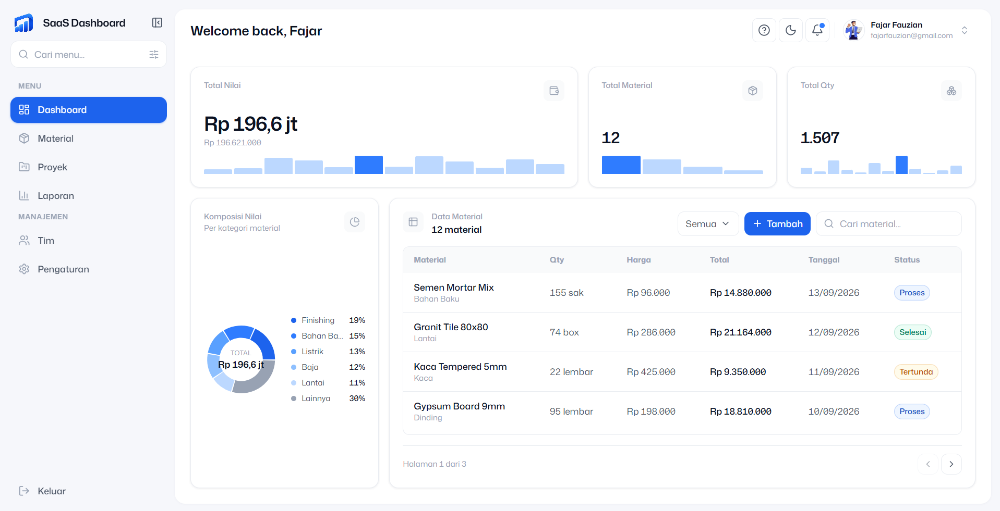

# SaaS Dashboard

Dashboard monitoring material & proyek konstruksi. Menampilkan KPI nilaiprocurement, komposisi kategori (donut chart), dan tabel material dengan
pencarian real time, filter status, serta form tambah via modal.

Dibangun sebagai submission tugas data masih mock/dummy (in memory),
tanpa backend.

## Preview



> Screenshot dashboard pada 1440px menampilkan 4 KPI card, donut chart
> komposisi kategori, dan tabel material.

## Fitur

| Fitur | Keterangan |
|---|---|
| 4 KPI card | Total Nilai · Total Material · Total Qty · Komposisi Nilai |
| Donut chart | Komposisi nilai per kategori material (top 5 + Lainnya) |
| Mini bar sparkline | Distribusi nilai / qty / status di tiap KPI card |
| Tabel material | 5 row per halaman, pagination, header sticky |
| Card list (mobile) | Otomatis ganti tabel di bawah 640px |
| Pencarian real-time | Filter nama, kategori, unit reset ke halaman 1 |
| Filter status | Semua · Selesai · Proses · Tertunda · Dibatalkan |
| Tambah material | Modal form dengan validasi inline |
| Kalkulasi | `total = qty × harga`, dihitung ulang otomatis |
| Responsive | 375px · 768px · 1440px · landscape |
| Aksesibilitas | `aria-invalid`, `aria-describedby`, focus ring, Escape close |

## Tech Stack

| Library | Versi |
|---|---|
| React | 19 |
| Vite | 8 |
| Tailwind CSS | v4 (CSS-first, `@theme`) |
| Recharts | 3.x |
| Lucide React | 1.48 |
| Fontsource | Mona Sans 400/500/600/700 |
| ESLint | 10 (flat config) |

## Prerequisites

- Node.js >= 20.19
- npm >= 10

## Getting Started

```bash
git clone https://github.com/zianscode/saas-dashboard.git
cd saas-dashboard
npm install
npm run dev
```

Buka `http://localhost:5173`

## Scripts

| Command | Fungsi |
|---|---|
| `npm run dev` | dev server dengan HMR |
| `npm run build` | production build ke `dist/` |
| `npm run preview` | preview hasil build |
| `npm run lint` | ESLint check |

## Struktur Folder

```
src/
├── components/
│   ├── dashboard/          
│   │   ├── CategoryDonutChart.jsx
│   │   ├── DataTable.jsx
│   │   ├── KpiCard.jsx
│   │   ├── MaterialFormModal.jsx
│   │   ├── MiniBars.jsx
│   │   └── StatusFilter.jsx
│   ├── layout/             
│   │   ├── AppLayout.jsx
│   │   ├── Sidebar.jsx
│   │   └── Topbar.jsx
│   └── ui/
│       └── Logo.jsx
├── data/
│   ├── dummyMaterials.json 
│   └── navigation.js       
├── hooks/
│   ├── useMaterialTable.js 
│   ├── useMaterials.js     
│   └── useMediaQuery.js    
├── services/
│   └── materialService.js  
├── utils/
│   ├── format.js           
│   └── validation.js       
├── App.jsx
├── index.css               
└── main.jsx
```

## Arsitektur Data

```
                    dummyMaterials.json (12 baris)
                                 ↓
                    services/materialService.js
                    getMaterials() · latency 450ms
                                 ↓
                    hooks/useMaterials.js
              materials · isLoading · error · addMaterial
                                 ↓
        ┌────────────────────────┴────────────────────────┐
        ↓                                                  ↓
  hooks/useMaterialTable.js                          src/App.jsx
  search · statusFilter · page                     ├─ reduce()  → KPI angka
  rows · totalPages                                └─ useMemo() → MiniBars
        ↓                                                  ↓
        ↓                                                  ↓
components/dashboard/DataTable.jsx          CategoryDonutChart · KpiCard · MiniBars
```

Semua angka & chart **dihitung dari data** — tidak ada angka hardcode di
komponen. Mengubah `dummyMaterials.json` → semua KPI & chart ikut berubah.

## Kenapa? `qty × harga`

Requirement tugas: menampilkan **total harga**. `total harga` hanya punya
arti jika ada barang terkuantifikasi, jadi domain dipilih sebagai
procurement material konstruksi.

Rumus di `src/utils/format.js`:

```js
export function getSubtotal(material) {
  return Number(material.qty) * Number(material.price);
}
```

## Validasi

`src/utils/validation.js` menolak:

| Input | Hasil |
|---|---|
| kosong | "wajib diisi" |
| `0` / negatif | "lebih besar dari 0" |
| desimal (`1.5`) | "harus bilangan bulat" |
| non-angka (`1e999`) | "harus berupa angka" |
| melebihi batas | "maksimal 1.000.000" |

Error muncul inline per field + error summary di atas form, denganauto scroll & fokus ke field pertama yang error.

## Catatan

- Data **mock in memory** — refresh browser mengembalikan data ke 12 row awal
- Tidak ada backend / API eksternal
- `Update` & `Delete` **tidak diimplementasikan** (di luar scope tugas)